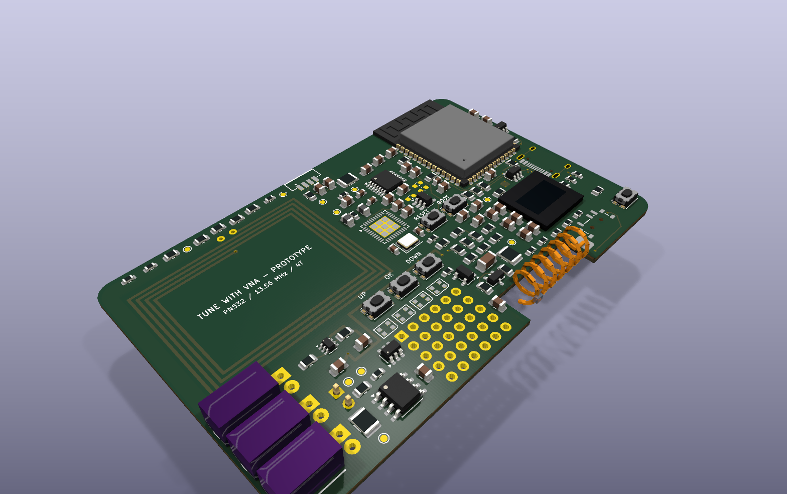
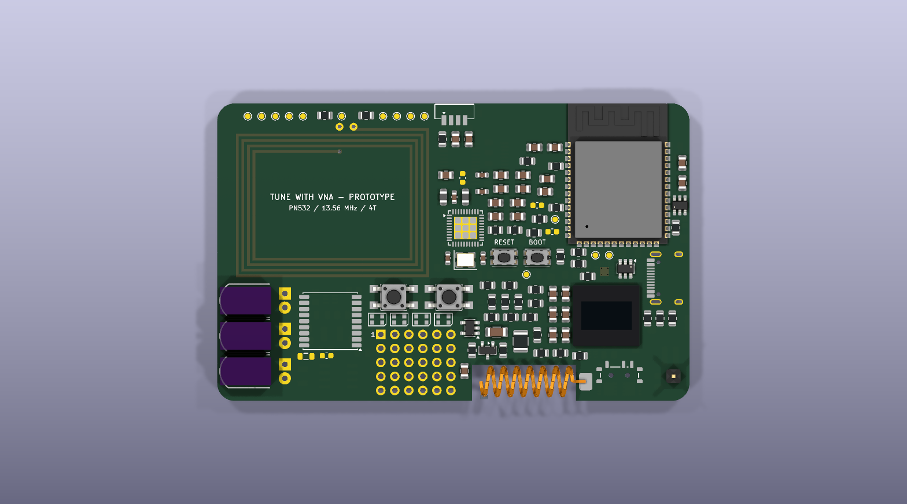
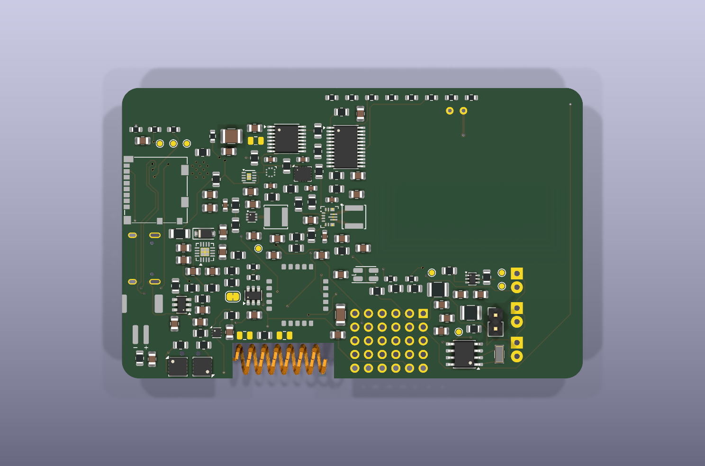

# PocketLab Card V1

<p align="center">
  
</p>

PocketLab Card V1 is an original, credit-card-outline ESP32-S3 field tool with
Wi-Fi/BLE control, NFC, LF RFID, Sub-GHz, infrared, removable storage and a
small local user interface. The hardware is designed around a four-layer PCB,
a single-cell LiPo supply and parts that can be assembled by JLCPCB or fitted by
hand where practical.

> [!NOTE]
> **Proudly vibe-coded.** The project grows through hands-on experimentation,
> rapid idea-driven iteration and AI-assisted engineering. Here, vibe coding
> does not mean blindly trusting generated output: the hardware remains an
> engineering prototype until its schematic, PCB, DRC/DFM results and physical
> measurements have been independently checked.

> [!WARNING]
> **Engineering prototype — not ready to order.** Placement is complete and
> critical routing has started, but 159 connection items remain open. RF/LF
> tuning, final DRC/DFM, sourcing review and prototype measurements are still
> required before fabrication.

## Current hardware

| Area | V1 implementation |
|---|---|
| Controller | ESP32-S3-WROOM-1-N8R2 with native USB, Wi-Fi and BLE |
| 13.56 MHz NFC | PN532 with a project-local 35 x 27 mm four-turn PCB antenna |
| 125 kHz LF RFID | HTRC110 front end with a removable, measurable and tuneable coil |
| Sub-GHz | E07-900MM10S/CC1101 module, tuneable pi network and inboard 868 MHz spring antenna |
| Infrared | Three independent high-power 940 nm emitters plus a 38 kHz receiver |
| Storage and security | microSD, ATECC608C secure element and physical PAIR button |
| User interface | 0.42-inch 72 x 40 OLED, four RGB LEDs and UP/OK/DOWN buttons |
| Sensors | Optional 6-axis IMU, barometer, RTC, fuel gauge and board-temperature monitor |
| Power | USB-C, 1-cell LiPo input, charging/power path, regulated 3.3 V and switchable 5 V |
| Expansion | Protected 2.54 mm breakout matrix with eleven direct expansion GPIOs |

The **ESP32-S3 remains the controller for V1**. The newer ESP32-S31 is being
kept as a possible V2 candidate, but its preliminary hardware ecosystem,
larger WROOM module and immature availability do not justify restarting this
layout.

## Current PCB views

The following images were generated from the current KiCad routing checkpoint.
The hand-fitted IR bodies and spring antenna use approximate preview models;
footprints, courtyards and the PCB outline remain the mechanical references.

<table>
  <tr>
    <td align="center"><br><strong>Top</strong></td>
    <td align="center"><br><strong>Bottom</strong></td>
  </tr>
</table>

More layout and enclosure notes are available in the
[design overview](docs/design-overview/README.md).

## Mechanical target

- 85.60 x 53.98 mm credit-card outline with rounded corners
- Four-layer, nominal 1.2 mm FR-4 using the JLC04121H-7628 stack target
- 1 oz outer and 0.5 oz inner copper with ENIG finish
- Components on both sides; approximately 8–9 mm provisional assembled height
- Three inboard edge-facing IR emitters and an inboard spring-antenna pocket
- Compact unpopulated 6 x 5 matrix of 30 holes on 2.54 mm pitch
- Initial bring-up quantity: five assembled prototype boards

This is a credit-card-shaped instrument, not a wallet-thickness card. The final
height and enclosure clearances must be verified against received components.

## Engineering status

| Check | Current result |
|---|---:|
| Schematic symbols | 274 |
| Assigned footprints | 267 |
| Named logical nets | 181 |
| Physical PCB nets | 231 |
| ERC | 0 errors / 0 warnings |
| Placed footprints | 267 / 267 |
| Routed checkpoint | 1734 track segments / 327 vias / 23 zones |
| Remaining connection items | 159 |
| Current routed-geometry/parity errors | 0 |
| Reviewed footprint-library warnings | 6 |

Completed design work includes the full schematic, mechanical placement,
four-layer stack definition, native USB pair, local converter routes, RTC
crystal routes, the provisional Sub-GHz feed/pi network and the via-free
back-side LF RFID analog island. Sensitive digital nets that conflicted with
the accepted USB, button and LF placement were cleanly returned to the ratsnest
instead of leaving partial copper behind.

### Before the first PCB order

- Confirm the live JLCPCB stack and recalculate USB/Sub-GHz geometry.
- Complete the remaining LF support connections and route NFC manually.
- Complete digital routing, protection branches, ground stitching and planes.
- Close the remaining connection items and run final KiCad DRC/parity checks.
- Review every footprint, BOM and placement entry against current supplier data.
- Reconfirm PN532 availability because the part is NRND, and qualify an
  alternative before any production revision.
- Inspect the JLCPCB DFM, BOM and CPL previews and obtain an independent review.
- Tune NFC, LF RFID and Sub-GHz on the assembled prototypes with suitable test
  equipment before treating any RF values as production-ready.

The detailed hand-off state is maintained in the
[work checkpoint](docs/work-checkpoint.md).

## Repository layout

```text
PocketLab-Card/
|-- docs/           Architecture, constraints, checkpoints and current renders
|-- hardware/       KiCad source, local libraries, reports and layout helpers
|-- firmware/       ESP32-S3 firmware source and board configuration
`-- manufacturing/  Fabrication/assembly generation tools and future releases
```

Open `hardware/PocketLab-Card.kicad_pro` in KiCad 10 for the complete project.
The tracked `hardware/PocketLab-Card.kicad_pcb` is the current routing-in-progress
board, not a fabrication release.

## Responsible use

RF, RFID/NFC and infrared functions are intended only for devices, systems,
frequencies, antennas, output levels and duty cycles the operator is legally
permitted to use. Prototype RF performance, electromagnetic compatibility and
regulatory compliance have not yet been verified.

The project is original and does not copy SGP branding, artwork, PCB layout or
firmware.
