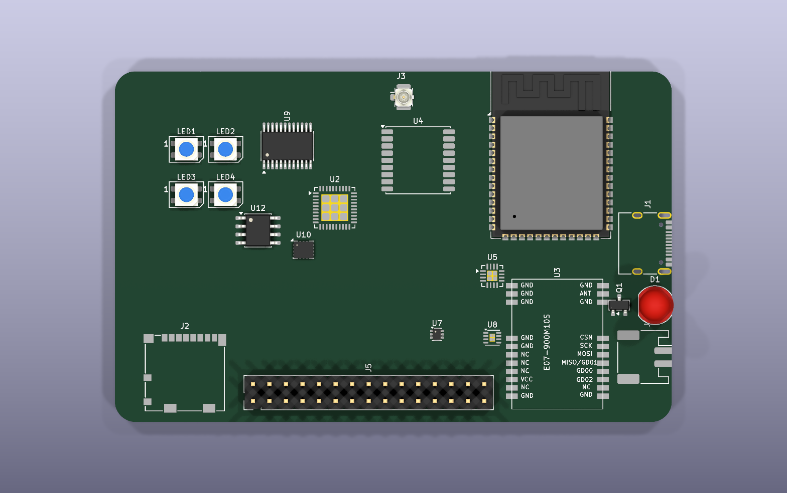

# PocketLab Card V1

PocketLab Card V1 is a credit-card-outline, battery-capable ESP32-S3 field
tool. The design is original and does not copy SGP branding, artwork, PCB
layout, or firmware.

## V1 feature set

- ESP32-S3-WROOM-1-N8R2 Wi-Fi/BLE module with local web interface
- PN532 13.56 MHz NFC reader/writer
- Ebyte E07-900M10S IPEX CC1101 Sub-GHz module for the European 868 MHz build
- u-blox MAX-M10S GNSS receiver with an external U.FL antenna connector
- microSD trip and capture storage
- high-power 940 nm IR transmitter and 38 kHz IR receiver
- USB-C data/power, external 1-cell LiPo connector, charging and power path
- regulated 3.3 V rail and switchable 5 V auxiliary/IR rail
- optional 6-axis IMU/barometer, SOIC RTC and battery fuel gauge
- RGB LEDs, buzzer and user buttons
- 2.54 mm expansion headers

## Target mechanics

- Board outline: 85.60 mm x 53.98 mm, rounded corners
- PCB: 4 layers, 1.6 mm FR-4
- Unpopulated 2 x 15, 2.54 mm expansion footprint
- Initial prototype quantity: 5 assembled boards

The PCB keeps the credit-card outline, but it is not a wallet-thickness card.
Because the dense layout places modules/connectors on both sides, the complete
unheadered assembly is expected to need roughly 8-9 mm of thickness before
enclosure clearance; the final value must be checked in the KiCad 3D model and
against received parts. The optional edge-facing 5 mm IR LED protrudes beyond
the outline and is installed by hand after assembly.



## Repository layout

```text
PocketLab-Card/
|-- docs/           Architecture, pin allocation and design constraints
|-- hardware/       KiCad design source and preliminary BOM
|-- firmware/       ESP32 board definition and firmware source
`-- manufacturing/  Fabrication and assembly outputs
```

## Current status

The generated KiCad 10 schematic now contains 239 symbols, 232 assigned
footprints and 168 named nets. Its current ERC report is clean. This includes
the two I/O expanders, protected expansion connections, GNSS and microSD
updates, rail test points, and the project-local 35 x 27 mm four-turn NFC-loop
footprint.

PCB placement and routing are still in progress. The image above is an earlier
mechanical study, not the current netlisted board and not a fabrication
preview. The project is **not ready to order** until placement, routing,
stack-up-dependent USB/RF geometry, DRC, manufacturing exports and independent
review are complete. The NFC loop is a prototype geometry whose matching must
be measured and tuned on the assembled card with a VNA; PN532 is NRND and its
availability must be checked before every build.

All RF transmit functions are intended only for frequencies, power levels,
antennas, duty cycles, devices and systems the operator is permitted to use.
Prototype RF performance and regulatory compliance have not yet been verified.
