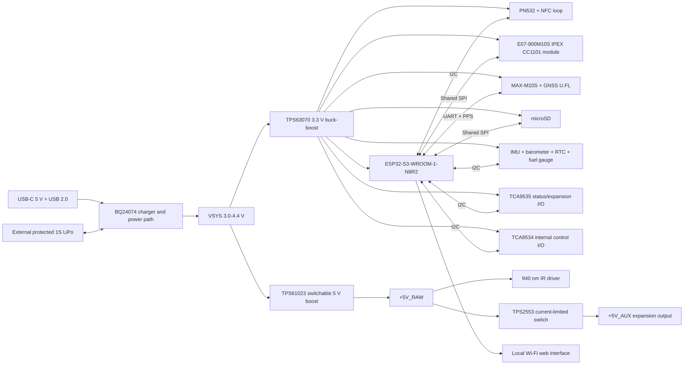

# Hardware architecture

## System block diagram

## Power domains

| Domain | Nominal voltage | Source | Main loads |
|---|---:|---|---|
| VBUS | 5 V | USB-C | Charger input only |
| VBAT | 3.0-4.2 V | External 1S LiPo | Charger/power path |
| VSYS | 3.0-4.4 V | BQ24074 power path | DC/DC inputs |
| +3V3 | 3.3 V | TPS63070 | MCU, radios, storage, sensors |
| +5V_RAW | 5.0 V switchable | TPS61023 | IR driver and TPS2553 input |
| +5V_AUX | 5.0 V protected | TPS2553 from +5V_RAW | J5 pin 29 only |
| GNSS_3V3 | 3.3 V switched | TPS22919 from +3V3 | MAX-M10S VCC and V_IO |

The 5 V converter is disabled by default. Firmware enables it only for IR or
an explicitly requested auxiliary load. IR is connected directly to
`+5V_RAW`; only the external `+5V_AUX` header pin is downstream of the TPS2553
current-limited switch and targeted at 500 mA maximum. Firmware must arbitrate
the combined boost load, while the hardware header current limit remains
independent of firmware.

## Digital buses

| Bus | Devices | Notes |
|---|---|---|
| I2C | PN532, TCA9535, TCA9534, optional BMI270/BMP390, PCF8563, MAX17048 | 3.3 V, one 3.3-kohm pull-up pair, 400 kHz target |
| SPI | E07 CC1101 module, microSD | Shared SCK/MOSI/MISO, dedicated chip selects |
| UART1 | MAX-M10S | GNSS UBX/NMEA control and data |
| USB | ESP32-S3 native USB | Firmware upload, CDC and optional HID |

## RF floorplan rules

1. Put the ESP32 module antenna at a short board edge and respect its
   all-layer keep-out.
2. Keep the GNSS module beside its U.FL connector with a very short 50 ohm
   trace; keep the 5 V switching converter away from this corner.
3. Allocate one edge to the 868 MHz E07-900M10S IPEX module. Its own IPEX
   connector is the only Sub-GHz antenna path; pin 21 stays NC and there is no
   separate board-level J6 connector.
4. Use a smaller NFC loop around the opposite half of the card instead of a
   full-board loop, avoiding the Wi-Fi and Sub-GHz antenna zones.
5. Provide an NFC matching-network population option on the first prototype.
   The 35 x 27 mm, four-turn loop and its 36 x 29 mm keep-out are preliminary;
   tune the assembled board with a VNA. The E07 module contains its own CC1101
   crystal and match.
6. The selected E07-900M10S IPEX variant is the EU 868 MHz build. A different
   regional variant is a separately reviewed assembly choice, not an automatic
   substitution; antenna, firmware limits and local rules must match it.

## GNSS antenna configuration

The default build uses a passive antenna on the board-level GNSS U.FL. MAX-M10S
`V_BCKP` is NC, so V1 does not promise hot-start retention while GNSS power is
off. The optional active-antenna bias parts R505, L501 and C504 are DNP; fitting
them requires a review of the complete u-blox bias/supervision topology and RF
measurements. R507 and R508 are fixed 1-kohm UART back-power limit resistors.

## Firmware power arbitration

The following high-load combinations must be limited:

- High-power IR dims the RGB LEDs and blocks concurrent NFC field operation.
- The protected 5 V header is disabled or load-limited by policy while an IR
  burst uses the shared +5V_RAW boost capacity.
- microSD writes are buffered during IR bursts.
- Low-battery mode disables high-power IR and reduces Wi-Fi transmit power.
