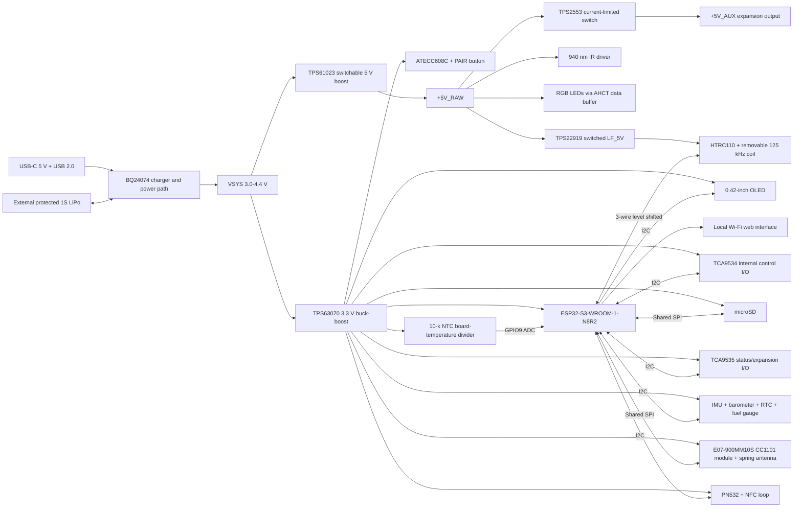

# Hardware architecture

## System block diagram

## Power domains

| Domain | Nominal voltage | Source | Main loads |
|---|---:|---|---|
| VBUS | 5 V | USB-C | Charger input only |
| VBAT | 3.0-4.2 V | External 1S LiPo | Charger/power path |
| VSYS | 3.0-4.4 V | BQ24074 power path | DC/DC inputs |
| +3V3 | 3.3 V | TPS63070 | MCU, radios, storage, sensors |
| +5V_RAW | 5.0 V switchable | TPS61023 | IR driver, RGB LEDs and TPS2553 input |
| +5V_AUX | 5.0 V protected | TPS2553 from +5V_RAW | J5 pin 29 only |
| LF_5V | 5.0 V switched | TPS22919 from +5V_RAW | HTRC110, oscillator and AHCT level shifter |

The 5 V converter is disabled by default. Firmware enables it only for IR,
RGB illumination or an explicitly requested auxiliary load. IR and the RGB
LED supply are connected directly to `+5V_RAW`; only the external `+5V_AUX`
header pin is downstream of the TPS2553
current-limited switch and targeted at 500 mA maximum. Firmware must arbitrate
the combined boost load, while the hardware header current limit remains
independent of firmware.

`RGB_DATA` passes through a 5-V SN74AHCT1G126 before the first LED. The
buffer's active-high output enable is tied to `BOOST5_EN`; the output is
high-impedance whenever the boost is off, avoiding back-power through the LED
data input.

SW5 is the main user power switch, but it does not carry battery or USB charge
current. It switches the TPS63070 enable node between `PWR_SW_ON` and GND;
R735 holds that node low while off. The BQ24074 charger, protection circuit and
USB power path therefore remain available for safe charging while the 3.3-V
system rail and all dependent functions are off.

## Digital buses

| Bus | Devices | Notes |
|---|---|---|
| I2C | PN532, OLED, TCA9535, TCA9534, optional BMI270/BMP390, PCF8563, MAX17048 | 3.3 V, one 3.3-kohm pull-up pair, 400 kHz target |
| SPI | E07 CC1101 module, microSD | Shared SCK/MOSI/MISO, dedicated chip selects |
| LF three-wire | HTRC110 | GPIO18 SCLK, GPIO21 DOUT, GPIO35 DIN through level shifters |
| USB | ESP32-S3 native USB | Firmware upload, CDC and optional HID |

## RF floorplan rules

1. Put the ESP32 module antenna at a short board edge and respect its
   all-layer keep-out.
2. Keep the HTRC110 resonant bridge, current limiter, RX divider and coil
   connector in one short outer-layer loop; keep switch nodes away from RX.
3. Keep the E07-900MM10S module close to the lower-edge matching network. Pin 6
   feeds the C403/R405/C404 pi network and the hand-soldered T3-868M spring;
   the complete spring lies inside the milled pocket and card envelope.
4. Use a smaller NFC loop around the opposite half of the card instead of a
   full-board loop, avoiding the Wi-Fi and Sub-GHz antenna zones.
5. Provide an NFC matching-network population option on the first prototype.
   The 35 x 27 mm, four-turn loop and its 36 x 29 mm keep-out are preliminary;
   tune the assembled board with a VNA. The E07 module contains its own CC1101
   crystal and internal module-level network, while the external pi remains a
   board/antenna tuning provision.
6. The selected E07-900MM10S is populated for the EU 868 MHz build. A different
   regional variant is a separately reviewed assembly choice, not an automatic
   substitution; antenna, firmware limits and local rules must match it.

## 125 kHz LF antenna configuration

J3 accepts a removable nominal 400-uH coil. C505 isolates the external coil
path, R502 limits fault/current stress, C506 is the 3.9-nF starting resonance
value and C507/C508 are DNP trim sites. R503 provides the protected return and
R504 divides the antenna tap for HTRC110 RX. These values are a bring-up
starting point only: measure actual inductance, Q, phase, coil current and tap
voltage before fitting final values or attempting tag write modes.

## Firmware power arbitration

The following high-load combinations must be limited:

- High-power IR dims the RGB LEDs and blocks concurrent NFC field operation.
- The protected 5 V header is disabled or load-limited by policy while an IR
  burst uses the shared +5V_RAW boost capacity.
- microSD writes are buffered during IR bursts.
- Low-battery mode disables high-power IR and reduces Wi-Fi transmit power.
