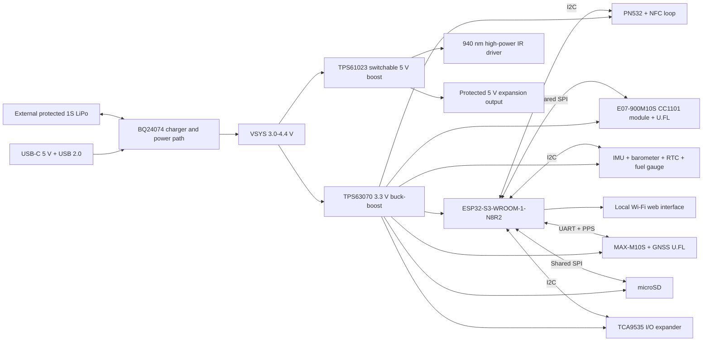

# Hardware architecture

## System block diagram

## Power domains

| Domain | Nominal voltage | Source | Main loads |
|---|---:|---|---|
| VBUS | 5 V | USB-C | Charger input only |
| VBAT | 3.0-4.2 V | External 1S LiPo | Charger/power path |
| VSYS | 3.0-4.4 V | BQ24074 power path | DC/DC inputs |
| +3V3 | 3.3 V | TPS63070 | MCU, radios, storage, sensors |
| +5V_AUX | 5.0 V | TPS61023 | IR driver and protected header pin |
| GNSS_BACKUP | 3.3 V low current | VBAT-derived | GNSS hot-start retention |

The 5 V converter is disabled by default. Firmware enables it only for IR or
an explicitly requested auxiliary load. The external +5V_AUX pin is targeted
at 500 mA maximum and must use a current-limited load switch. IR pulse current
is budgeted separately, with a combined 5 V rail limit enforced in firmware.

## Digital buses

| Bus | Devices | Notes |
|---|---|---|
| I2C | PN532, TCA9535, optional BMI270/BMP390, PCF8563, MAX17048 | 3.3 V, 400 kHz target |
| SPI | E07 CC1101 module, microSD | Shared SCK/MOSI/MISO, dedicated chip selects |
| UART1 | MAX-M10S | GNSS UBX/NMEA control and data |
| USB | ESP32-S3 native USB | Firmware upload, CDC and optional HID |

## RF floorplan rules

1. Put the ESP32 module antenna at a short board edge and respect its
   all-layer keep-out.
2. Keep the GNSS module beside its U.FL connector with a very short 50 ohm
   trace; keep the 5 V switching converter away from this corner.
3. Allocate one edge to the 868 MHz E07 module and its antenna connector.
4. Use a smaller NFC loop around the opposite half of the card instead of a
   full-board loop, avoiding the Wi-Fi and Sub-GHz antenna zones.
5. Provide an NFC matching-network population option and RF test point on the
   first prototype. The E07 module contains its own CC1101 crystal and match.
6. The default E07-900M10S covers the EU 868 MHz build. The pin-compatible
   E07-400M10S is the 433 MHz assembly alternative; fit the correct antenna.

## Firmware power arbitration

The following high-load combinations must be limited:

- High-power IR dims the RGB LEDs and blocks concurrent NFC field operation.
- The protected 5 V header limit is reduced while IR boost mode is active.
- microSD writes are buffered during IR bursts.
- Low-battery mode disables high-power IR and reduces Wi-Fi transmit power.
